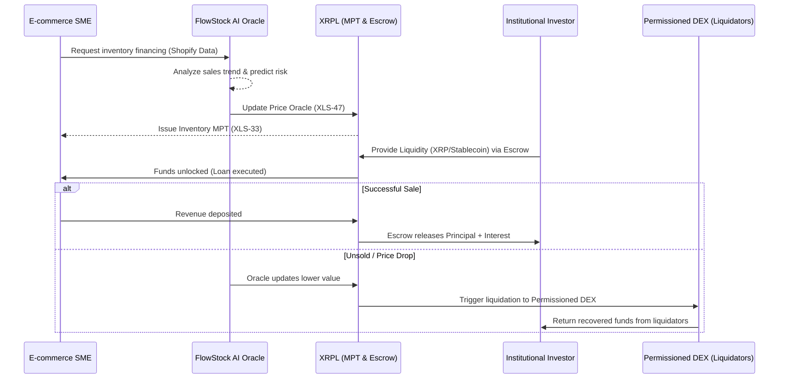

# 📦 FlowStock AI

## 📌 About The Project (프로젝트 소개)
**FlowStock AI** is a B2B inventory collateral financing platform that combines AI predictive modeling with XRPL's RWA tokenization (MPT). It solves the massive liquidity crisis of e-commerce SMEs by evaluating the real-time value of "unsold inventory" and tokenizing it to attract institutional liquidity.

FlowStock AI는 이커머스 중소기업(SME)의 창고에 잠든 '미판매 재고(Unsold Inventory)'의 미래 가치를 AI로 평가하고, 이를 XRPL의 MPT(Multi-Purpose Token)로 토큰화하여 즉각적인 유동성을 공급하는 B2B 재고 담보 금융 플랫폼입니다. 과거의 영수증을 다루는 인보이스 팩토링의 한계를 넘어, **AI 수요 예측 모델과 결합된 미래 지향적 RWA(실물자산) 금융**을 제시합니다.

## 🚀 Core XRPL Features (XRPL 기술 활용도)
This project deeply utilizes the latest XRPL primitives to build a secure, enterprise-grade decentralized finance protocol without relying on traditional smart contracts.

1. **MPT (XLS-33):** Tokenizing large-scale inventory into fractional, fungible multi-purpose tokens. (대규모 재고 자산을 분할 가능한 MPT로 유동화)
2. **Price Oracles (XLS-47):** Fetching real-time AI-evaluated inventory values to dynamically adjust liquidation thresholds. (AI가 평가한 재고 가치를 온체인에 기록하여 청산 임계값 자동 조정)
3. **Permissioned DEX (XLS-81) & Credentials (XLS-70):** Ensuring only KYC-verified institutional buyers and wholesale liquidators can trade these inventory tokens. (인증된 기관 및 B2B 도매업자만 참여하는 허가형 청산 풀 운영)
4. **Token-Enabled Escrows (XLS-85):** Locking loan funds securely and automating repayments upon successful inventory sales. (안전한 자금 잠금 및 판매 발생 시 자동 대출 상환)

## 🏗️ System Architecture (시스템 아키텍처)

## 🛠️ Tech Stack (기술 스택)
* **Blockchain:** XRP Ledger (xrpl.js), MPT, Escrow, Price Oracles
* **Backend:** Node.js, Express, XRPL SDK
* **AI Model:** Python, TensorFlow (Demand Prediction & Risk Modeling)
* **Frontend:** React.js, TailwindCSS
* **Integration:** Shopify API (Mocked for demo)
